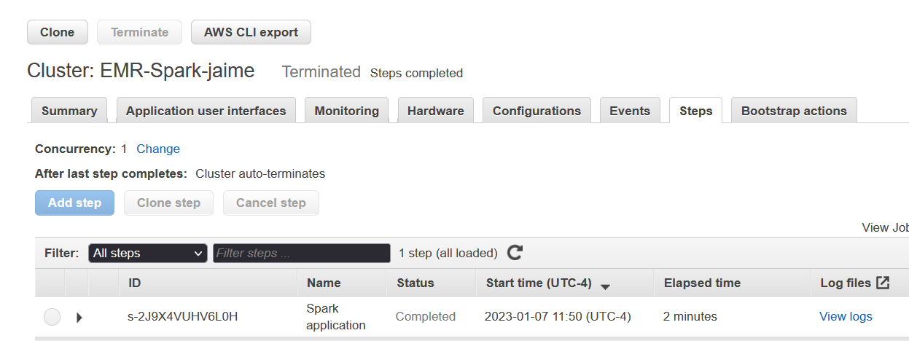

### FRANCISCO JAIME DA SILVA

## Projeto Engenharia de dados Cloud AWS usando EMR

O projeto consiste em criar um data lake no AWS S3 , fazer upload de dados processa-lo e converte-los para um formato mais adequado a analises levando em consideração espaço de armazenamento e performance do pyspark. 

---

### Etapas do Projeto

1. Foi Criado um datalake  no AWS S3 com estruta abaixo:

<ul>
  <li>Bancket(landing) - Landing zone ou Zona de Pouso(dados em formato bruto)</li>
  <li>Bancket(processing) - Processing zone(dados pre-processados)</li>
  <li>Bancket(cureted) - Cureted zone(Dados limpos, agregados e prontos para análises)</li>  
</ul> 

2.Foi realizado o upload dos arquivos de dados na zona de pouso(landing), extraídos do kaggle

<ul>
  <li>T201601PDPI+BNFT.csv</li>
  <li>T201602PDPI+BNFT.csv</li>
  <li>T201603PDPI+BNFT.csv</li>
  <li>T201604PDPI+BNFT.csv</li>   
</ul> 

3. Foi criado um cluster no AWS EMR

4. Foram realizadas a limpeza, preprocessamento e conversão para o formato parquet, visando melhorar a performance nas proximas etapas do processo. O resultado(df-formatado.parquet) desse processo foi gravado na Proessing zone.

5. Foi realiada a leitura dos dados em formato parquet e criada a view Dados_Sql para permitir exploração dos dados via SQL.

6. Foi aplicada agragação nos dados da view Dados_Sql e gravado o resultado na Cureted zone em formato parquet.(df-dadosSQL.parquet)

7. Foi criado uma action nesse repositório para copiar o codigo da aplicação(Aws-EMR-spark.py) para o AWS S3(s3://landing-jaime/app/), apara o AWS EMR possa executa-la.Caso haja alteração na aplicação as proxima execuções do ERM já irão refletir as alterações.

8. foi criado o arquivo de saida(stdout).
<https://github.com/jaimesilvads/SparkAmazonEMR/blob/main/stdout>

